# AD Hardening Baseline 🛡️

**Boîte à outils PowerShell pour le durcissement Active Directory — aligné CIS Benchmark**

> 🇫🇷 [Version française](#) | 🇬🇧 [English version](README.en.md)

---

## Objectif

Collection de scripts PowerShell prêts à l'emploi pour auditer et durcir les environnements Active Directory. Chaque script cible un vecteur d'attaque documenté en pentest réel, avec des remédiations alignées sur les référentiels CIS Benchmark, NIST SP 800-53 et ISO 27001.

Construit à partir d'une expérience offensive concrète — chaque action de durcissement contrecarre directement une technique d'attaque éprouvée.

---

## Démonstration

Tous les scripts ont été testés sur un lab AD réaliste ([GOAD — Game of Active Directory](https://github.com/Orange-Cyberdefense/GOAD)) composé de 5 machines Windows Server avec 3 domaines et des forêts en relation d'approbation.

### Rapport consolidé HTML

Le script `10-generate-report.ps1` génère un rapport HTML interactif avec le statut de chaque contrôle, le mapping CIS et MITRE ATT&CK :

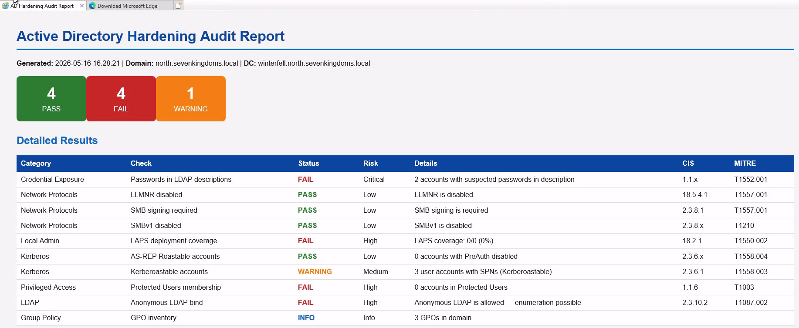

---

## Scripts

| # | Script | Fonction | Contre |
|---|--------|----------|--------|
| 01 | `01-audit-ad-passwords.ps1` | Détecte les mots de passe dans les descriptions LDAP et scripts SYSVOL | Récolte de credentials (AS-REP, SYSVOL mining) |
| 02 | `02-disable-llmnr-nbtns.ps1` | Désactive LLMNR et NBT-NS via le registre | Relais NTLM, empoisonnement Responder |
| 03 | `03-enforce-smb-signing.ps1` | Force la signature SMB et désactive SMBv1 | Relais NTLM, attaques SMB |
| 04 | `04-deploy-laps.ps1` | Audite le déploiement LAPS pour la rotation des mots de passe admin locaux | Pass-the-Hash, mouvement latéral |
| 05 | `05-harden-kerberos.ps1` | Force AES256, désactive RC4, audite les SPNs et PreAuth | Kerberoasting, AS-REP Roasting |
| 06 | `06-audit-acl-delegations.ps1` | Audite les ACLs dangereuses et délégations sur les objets AD | Chaînes d'abus ACL, escalade de privilèges |
| 07 | `07-harden-ldap.ps1` | Désactive le bind LDAP anonyme, force le channel binding | Énumération LDAP, reconnaissance |
| 08 | `08-audit-gpo-security.ps1` | Audite les permissions GPO et détecte les mauvaises configurations | Abus GPO, escalade de privilèges |
| 09 | `09-protected-users.ps1` | Vérifie l'appartenance au groupe Protected Users | Vol de credentials, abus de délégation |
| 10 | `10-generate-report.ps1` | Génère un rapport HTML consolidé de tous les contrôles | Reporting conformité |

---

## Captures d'écran

### 01 — Audit des mots de passe exposés

Détecte les mots de passe stockés dans les descriptions LDAP des comptes utilisateur et les scripts SYSVOL :

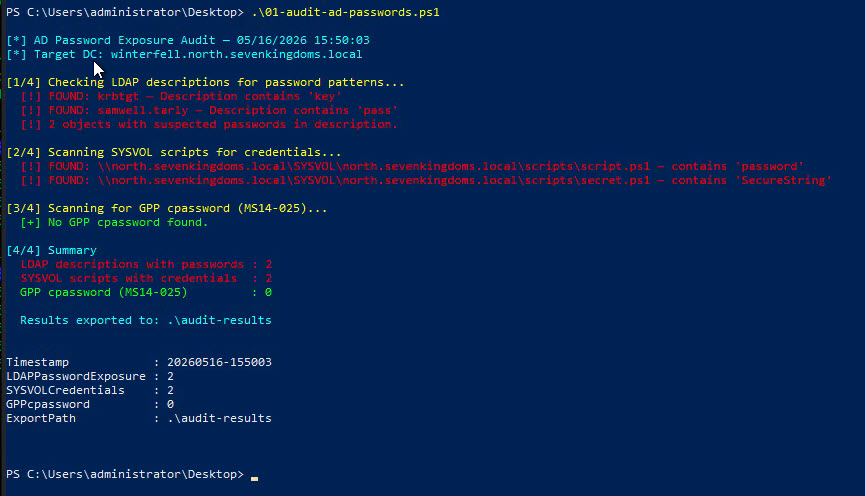

### 02 — Désactivation LLMNR / NBT-NS

Vérifie et désactive les protocoles LLMNR et NBT-NS, vecteurs principaux pour le poisoning Responder :

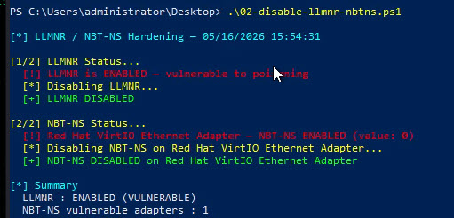

### 03 — Signature SMB obligatoire

Force la signature SMB côté serveur et client, désactive SMBv1 :

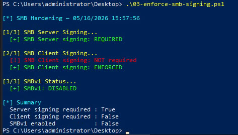

### 04 — Audit LAPS

Vérifie le déploiement LAPS (extension de schéma, couverture, expiration, GPO) :

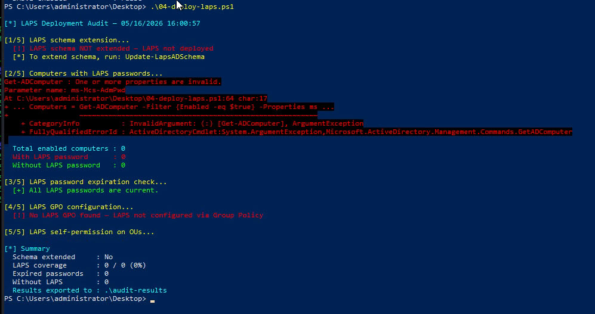

### 05 — Durcissement Kerberos

Audite les comptes AS-REP Roastable, les SPNs Kerberoastable, l'utilisation de RC4 et les politiques de mots de passe granulaires :

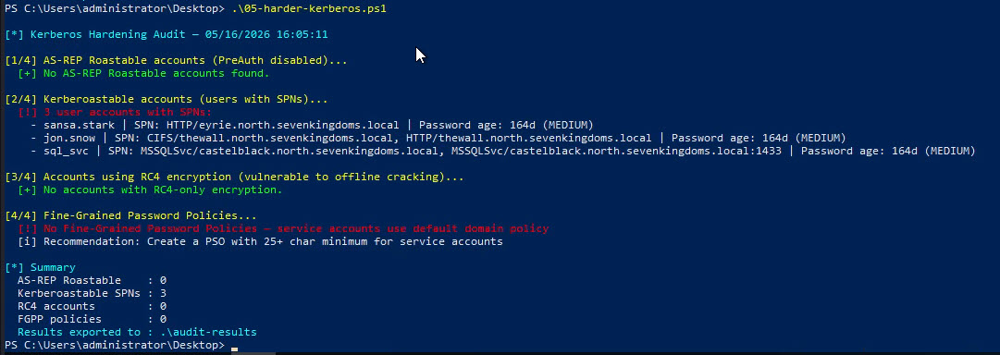

### 06 — Audit ACL et délégations

Analyse les ACLs dangereuses sur la racine du domaine, AdminSDHolder, les délégations non contraintes et les droits DCSync :

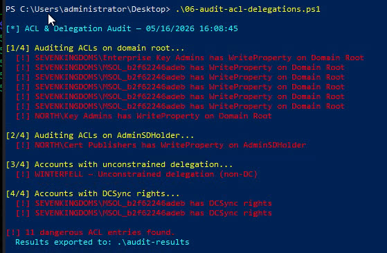

### 07 — Durcissement LDAP

Vérifie et corrige le bind LDAP anonyme, la signature LDAP et le channel binding :

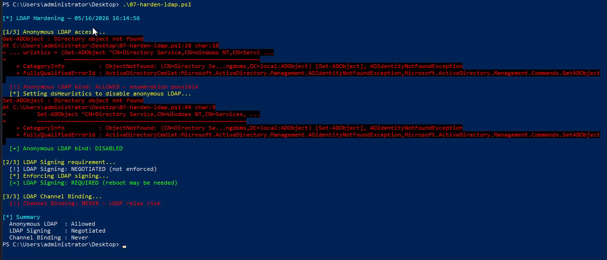

### 08 — Audit sécurité GPO

Détecte les utilisateurs avec des droits d'édition GPO à risque, les GPO non liées et les scripts embarqués :

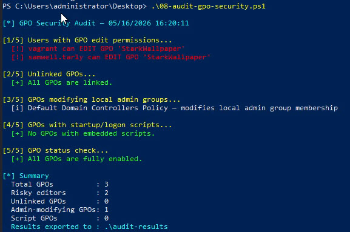

### 09 — Groupe Protected Users

Vérifie l'appartenance au groupe Protected Users pour les comptes privilégiés et AdminCount=1 :

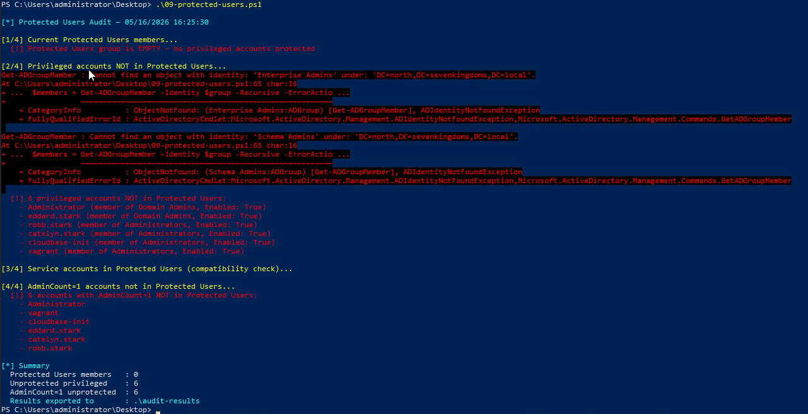

### 10 — Rapport consolidé

Exécute tous les contrôles et génère un rapport HTML avec scoring PASS/FAIL/WARNING :

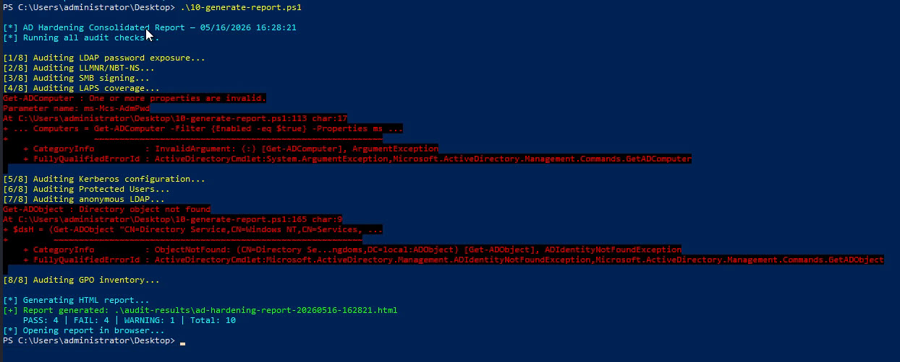

### Résultats d'audit (CSV)

Chaque script exporte ses résultats en CSV dans le dossier `audit-results/` :

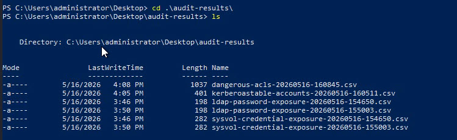

---

## Démarrage rapide

```powershell
# Cloner le dépôt
git clone https://github.com/hikenroot/ad-hardening-baseline.git
cd ad-hardening-baseline

# Lancer l'audit complet (lecture seule, aucune modification)
.\scripts\10-generate-report.ps1

# Lancer un contrôle individuel
.\scripts\01-audit-ad-passwords.ps1

# Mode audit uniquement (pas de remédiation)
.\scripts\05-harden-kerberos.ps1 -AuditOnly
```

---

## Mapping conformité

| Contrôle | CIS Benchmark | NIST 800-53 | ISO 27001 | Script |
|----------|---------------|-------------|-----------|--------|
| Désactiver LLMNR/NBT-NS | CIS 18.5.4.1 | SC-7 | A.13.1.1 | 02 |
| Forcer signature SMB | CIS 2.3.8.1 | SC-8 | A.13.1.1 | 03 |
| Déploiement LAPS | CIS 18.2.1 | AC-2 | A.9.2.3 | 04 |
| AES256 Kerberos | CIS 2.3.6.1 | SC-12 | A.10.1.1 | 05 |
| Désactiver LDAP anonyme | CIS 2.3.10.2 | AC-3 | A.9.4.1 | 07 |
| Groupe Protected Users | CIS 1.1.6 | AC-6 | A.9.2.3 | 09 |

---

## Mapping Attaque → Défense

Chaque script est lié à la technique offensive qu'il atténue :

| Technique d'attaque | MITRE ATT&CK | Script défensif |
|---------------------|--------------|-----------------|
| Credentials dans LDAP/SYSVOL | T1552.001, T1552.006 | `01-audit-ad-passwords.ps1` |
| Empoisonnement LLMNR/NBT-NS | T1557.001 | `02-disable-llmnr-nbtns.ps1` |
| Relais NTLM | T1557.001 | `03-enforce-smb-signing.ps1` |
| Pass-the-Hash | T1550.002 | `04-deploy-laps.ps1` |
| Kerberoasting | T1558.003 | `05-harden-kerberos.ps1` |
| AS-REP Roasting | T1558.004 | `05-harden-kerberos.ps1` |
| Abus ACL | T1222.001 | `06-audit-acl-delegations.ps1` |
| Reconnaissance LDAP | T1087.002 | `07-harden-ldap.ps1` |
| Abus GPO | T1484.001 | `08-audit-gpo-security.ps1` |
| Vol de credentials | T1003 | `09-protected-users.ps1` |

---

## Prérequis

- Windows Server 2016+ avec RSAT-AD-PowerShell
- Domain Admin ou équivalent pour les scripts de remédiation
- Accès lecture seule au domaine pour les scripts d'audit
- PowerShell 5.1+

---

## Avertissement

Ces scripts sont fournis à des fins légitimes de durcissement de la sécurité. Testez toujours dans un environnement hors production en premier. L'auteur ne saurait être tenu responsable de tout impact causé par l'exécution de ces scripts en production sans tests et gestion du changement appropriés.

---

## Auteur

**hik3nR00t** — [HikenRoot Forge](https://github.com/hikenroot/hikenroot-forge)

---

## Licence

MIT
